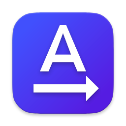

	
	<h1>TextBridge</h1>
		<h4>Paste your text effortlessly where the clipboard isn't accessible</h4>
     
    

        
    

	 
	 
	 
	 

TextBridge is a macOS application designed to simplify text transfer when the conventional clipboard feature isn't accessible.
This could be the case in scenarios like remote desktop sessions, virtual machines, or within applications that restrict clipboard access.

## Features

- Paste text by delay
- Paste text by shortcut
- Minimize text by removing all spaces and new lines
- Encode text into base64 format

## Installation

Download the latest release from the [releases page](https://github.com/Romancha/text-bridge/releases) and drag the app
to the Applications folder.

## Contributing

We welcome contributions from the community to enhance TextBridge further.

## License

This project is licensed under the MIT License - see the [LICENSE](LICENSE) file for details.